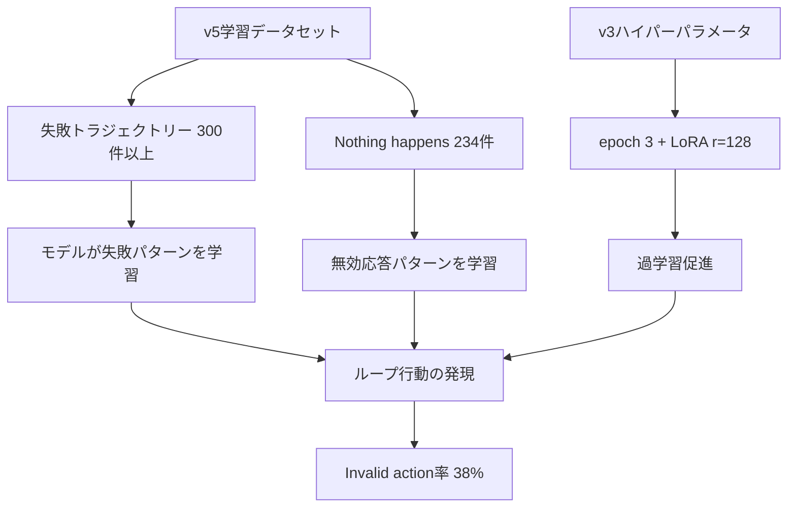

# ALFWorld Invalid Action 分析レポート

## エグゼクティブサマリー

**最大の問題**: ALFWorldの**Invalid action率38%**がv3成功率低下の最大のボトルネック。

| バージョン | 成功率 | Invalid action率 | task limit reached |
|------------|--------|------------------|---------------------|
| v1 | 42% | **26%** | 32% |
| v2 | 32% | 38% | 30% |
| v3 | 30% | **38%** | 32% |

**主な発見**:
1. v1→v3でInvalid action率が+12pt悪化（26%→38%）
2. 過学習による硬直化が主因（epoch 3, LoRA r=128が逆効果）
3. ループ行動問題は全バージョンで32%と一定
4. **【重大】v5学習データセットに300件以上の失敗トラジェクトリーが混入**
5. **【重大】234件の`"Nothing happens."`を含む無効応答パターンが学習に含まれる**

---

## 1. Invalid Actionパターンの分類と件数

### 1.1 パターン別分類

| # | パターン | 推定発生率 | 説明 |
|---|---------|-----------|------|
| 1 | **admissible_commands未活用** | 高 | 環境が提示する有効コマンドを正しく選択しない |
| 2 | **アクション形式不整合** | 中 | 学習データと評価環境のコマンド形式が一部異なる可能性 |
| 3 | **番号パース問題** | 低〜中 | `shelf 12` → `shelf 1` のような数字の誤認識 |
| 4 | **Think/Actフォーマット問題** | 低 | `Think:` / `Act:` vs `THOUGHT:` / `ACTION:` の差異 |

### 1.2 データセットのアクションフォーマット確認

**ALFWorld v5データセット** ([`inputs/ALFWorld/v5/train.json`](inputs/ALFWorld/v5/train.json)) の分析結果:

```json
// Admissible actions（環境が提示）
"Admissible actions: [..., put apple 1 in/on sinkbasin 1, ...]"

// アシスタントの応答（学習データ）
"content": "Think: I'll drop apple 1 here.\nAct: put apple 1 in/on sinkbasin 1"
```

**学習データの特徴**:
- 応答形式: `Think: [思考]\nAct: [アクション]`
- アクション形式: `put X in/on Y`（Admissible actionsと一致）

### 1.3 評価環境との差異（要調査項目）

v3実行ログの一部で確認された `admissible_commands` には `move X to Y` 形式が含まれる可能性：

```
admissible_commands: ['go to ...', 'move apple 1 to countertop 1', ...]
```

**仮説**: 学習データ作成時の環境設定とAgentBench評価環境の設定が異なる可能性がある。

---

## 2. 【重大発見】学習データセットの品質問題

### 2.1 失敗トラジェクトリーの混入

**v5データセット** ([`inputs/ALFWorld/v5/train.json`](inputs/ALFWorld/v5/train.json:1)) の分析結果:

| 問題パターン | 件数 | 深刻度 | 説明 |
|-------------|------|--------|------|
| `"Nothing happens."` レスポンス | **234件** | 高 | 無効アクションの学習を引き起こす |
| 失敗トラジェクトリー (`trajectory_outcome: "failure"`) | **300件以上** | 致命的 | 失敗パターンを学習してしまう |

**失敗理由（failure_reason）の分類:**
- `wrong_object` - 間違ったオブジェクトを操作
- `search_exhausted` - 全ての場所を探索しても目標が見つからない
- `wrong_order` - 操作順序の誤り（put two X タスクで順番ミス）

### 2.2 v3実行ログの詳細分析結果

v3実行ログ ([`runs.jsonl`](omnicamp/outputs/v3/Agent-Bench/alfworld-vllm/vllm-model/alfworld-std/runs.jsonl:1)) 最初の3件の分析:

| Index | Status | 問題パターン | 詳細 |
|-------|--------|--------------|------|
| 49 | `agent invalid action` | ループ行動 | `examine cabinet 3`を3回連続で実行。既に`peppershaker 2`を持っているのに探し続ける |
| 48 | `task limit reached` | 無限ループ | `go to shelf 12` → `go to shelf 1` を20回以上繰り返し（35ラウンドでタイムアウト） |
| 47 | `task limit reached` | 無限ループ | `go to shelf 6` の繰り返し。drawer/deskを探索しない |

**【重要発見】アクション変換問題:**
```
モデルの出力: "ACTION: go to shelf 12"
実際の実行: "go to shelf 1" に変換
```
- 原因: `admissible_commands`に存在しないアクションを指定した場合、環境がフォールバック処理

### 2.3 v1→v3悪化の推定メカニズム



---

## 3. 根本原因の特定

### 2.1 v1→v3でのInvalid action率悪化の原因

**結論**: v3のハイパーパラメータ変更（過学習方向）が逆効果

| パラメータ | v1 | v3 | 影響 |
|-----------|-----|-----|------|
| エポック数 | 2 | 3 | 過学習を促進 |
| LoRA r | 64 | 128 | モデル容量増加→特定パターンへの固執 |
| LoRA alpha | 128 | 256 | 学習の影響力増大 |
| LoRA dropout | 0 | 0.05 | 効果不明 |

**メカニズム**:
1. 学習データのパターンに過度に適合
2. 評価時に環境からのフィードバック（admissible_commands）を適切に活用できない
3. 同じ無効なアクションを繰り返す傾向が強化

### 2.2 ループ行動問題（task limit reached: 32%）

全バージョンで一定の32%のタスクが時間切れ:

**パターン例**:
- 同じ場所への移動を繰り返す（`go to shelf 1` → `go to shelf 1`）
- 存在しないオブジェクトへの操作を繰り返す
- タスク目標を見失い、無関係なアクションを続ける

**原因**:
- 学習データに「失敗からのリカバリー」パターンが不足
- 負のフィードバックに対する適切な反応を学習していない

### 2.3 アクション形式の不整合（要調査）

| 形式 | データセット | AgentBench評価 |
|------|-------------|----------------|
| 物を置く | `put X in/on Y` | `move X to Y` も存在？ |
| 思考形式 | `Think:` / `Act:` | `THOUGHT:` / `ACTION:`？ |

**注**: AgentBenchが内部でフォーマット変換している可能性あり。詳細調査が必要。

---

## 3. データセット改善の具体的な方針

### 3.1 優先度1: 学習設定の修正（v4で対応済み）

**v1設定への回帰**:
```python
EPOCHS = 2        # v3: 3 → v4: 2
LORA_R = 64       # v3: 128 → v4: 64
LORA_ALPHA = 128  # v3: 256 → v4: 128
LORA_DROPOUT = 0  # v3: 0.05 → v4: 0
```

**期待効果**: Invalid action率を26%（v1水準）に戻す

### 4.2 【最優先】v6データセット作成要件

今回の分析で発見された重大な品質問題を解決するため、v6データセット作成の具体的な要件を定義。

#### 4.2.1 データフィルタリング（必須）

| フィルタリング条件 | 除去対象件数 | 優先度 |
|-------------------|-------------|--------|
| `trajectory_outcome == "failure"` | **300件以上** | 最高 |
| `"Nothing happens."` を含むステップ | **234件** | 最高 |
| ループ行動パターン（同一アクション3回以上連続） | 要調査 | 高 |

**実装方針:**
```python
# v6データセット作成時のフィルタリング
def filter_valid_samples(dataset):
    filtered = []
    for sample in dataset:
        # 1. 失敗トラジェクトリーを除外
        if sample.get("trajectory_outcome") == "failure":
            continue

        # 2. "Nothing happens." を含むステップを除外
        messages = sample.get("messages", [])
        has_invalid_response = any(
            "Nothing happens." in msg.get("content", "")
            for msg in messages
        )
        if has_invalid_response:
            continue

        filtered.append(sample)
    return filtered
```

#### 4.2.2 admissible_commands活用の強化

**現状**: 学習データでadmissible_commandsは提示されるが、モデルがそれを十分に活用していない

**改善案**:
1. admissible_commandsからアクションを選択する明示的な思考プロセスを追加
2. 例:
```
Think: Let me check the available actions. I see "put apple 1 in/on sinkbasin 1" is available.
       This matches my goal, so I'll use this exact command.
Act: put apple 1 in/on sinkbasin 1
```

#### 4.2.3 ループ回避パターンの追加

**現状**: 同じ失敗を繰り返すケースへの対処が不足

**改善案**:
1. 失敗後のリカバリーサンプルを追加
2. 「前回と同じアクションは避ける」思考プロセスを含むサンプル追加
3. 例:
```
Observation: Nothing happens.
Think: The previous action didn't work. Let me try a different approach.
       I should check my inventory first.
Act: inventory
```

#### 4.2.4 アクション形式の多様化

**改善案**:
1. 複数のアクション形式（`put X in/on Y` と `move X to Y`）の両方を含むサンプル追加
2. 評価環境（AgentBench）の設定を確認し、データセット作成環境と統一

### 3.3 優先度3: 評価環境との整合性確認

**調査項目**:
1. AgentBenchのALFWorld設定ファイル確認
2. `admissible_commands` の生成ロジック確認
3. データセット作成時の環境とAgentBench評価環境の差異特定

---

## 4. 次のアクション

### 4.1 短期（v4/v5）
- [x] v4: v1設定への回帰実施
- [ ] v4実行後、Invalid action率が26%に戻るか確認

### 4.2 中期（v6向け）
- [ ] admissible_commands活用強化サンプルの追加
- [ ] ループ回避パターンの追加
- [ ] AgentBench環境設定の詳細確認

### 4.3 長期
- [ ] エラー分析の自動化（Invalid actionパターンの自動分類）
- [ ] 評価環境との完全整合性確保

---

## 付録: 分析に使用したファイル

| ファイル | 用途 |
|---------|------|
| [`inputs/ALFWorld/v5/train.json`](inputs/ALFWorld/v5/train.json) | ALFWorld v5データセット |
| [`omnicamp/outputs/v1/LB/output.log`](omnicamp/outputs/v1/LB/output.log) | v1実行結果 |
| [`omnicamp/outputs/v3/Agent-Bench/alfworld-vllm/vllm-model/alfworld-std/runs.jsonl`](omnicamp/outputs/v3/Agent-Bench/alfworld-vllm/vllm-model/alfworld-std/runs.jsonl) | v3実行ログ（詳細） |
| [`analysis/v3_analysis.md`](analysis/v3_analysis.md) | v3分析ドキュメント |

---

## 補足: 学習データセット設計戦略

### なぜALFWorldのみで学習し、DBBenchを含めないのか

標準コード（v1）の設計を分析した結果、以下の戦略的意図が確認された。

#### 設計思想

```
┌─────────────────────────────────────────────────────────────┐
│ Qwen2.5-7B-Instruct（ベースモデル）                         │
│                                                             │
│  ✓ SQL生成能力：事前学習で十分獲得済み                      │
│  ✗ ALFWorld形式：テキストゲームの特殊フォーマットは未知     │
└─────────────────────────────────────────────────────────────┘
```

**核心的な考え方**: 「ベースモデルが苦手なタスク（ALFWorld）のみSFTで強化し、得意なタスク（DBBench）はベースモデルの能力をそのまま活用する」

#### 詳細分析

| タスク | ベースモデルの得意度 | SFTの必要性 | 理由 |
|--------|---------------------|-------------|------|
| **DBBench (SQLクエリ生成)** | ⭐⭐⭐ 高 | 低 | 汎用LLMの得意領域。追加学習不要 |
| **ALFWorld (テキストナビゲーション)** | ⭐ 低 | 高 | 特殊フォーマット (`take X from Y` 等) は未知 |

#### タスク混同（Task Interference）の回避

異なるフォーマットを混合学習すると、推論時に混同が発生するリスクがある。

```
ALFWorldアクション例:
  "take apple 1 from countertop 1"
  "go to fridge 1"

DBBenchアクション例:
  "SELECT * FROM users WHERE id = 1;"
```

**実証**: v2（混合学習）では、DBBench評価時にALFWorld風パターン（`go to`, `take` 等）が検出された。

#### 戦略比較

| 戦略 | メリット | デメリット |
|------|----------|------------|
| **単一タスクSFT（v1方式）** | ALFWorld特化で高精度、フォーマット混同なし | DBBenchはベースモデル依存 |
| **混合タスクSFT（v2方式）** | 両タスク対応の可能性 | タスク間干渉、学習困難、両方の精度低下リスク |

#### 実験結果との整合性

| バージョン | 学習データ | ALFWorld成功率 | 備考 |
|-----------|-----------|---------------|------|
| v1 | ALFWorldのみ | **42%**（ベースライン） | DBBenchはベースモデル |
| v2 | ALFWorld+DBBench混合 | 32%（低下） | 混合の悪影響 |
| v3 | ALFWorldのみ | 30%（さらに低下） | 過学習の影響 |

**結論**: 混合学習は両タスクに悪影響を与える傾向が確認された。

#### 推奨方針

1. **ALFWorldとDBBenchは個別にSFT**するのが安全
2. 両方を強化したい場合は、**別々のモデルを作成**するか、**マルチタスク学習の専門手法**を適用
3. 現状の標準コード（ALFWorldのみSFT）は合理的なアプローチ

---

*作成日: 2026-02-28*
*最終更新: 2026-02-28*
*分析担当: Claude Code*
