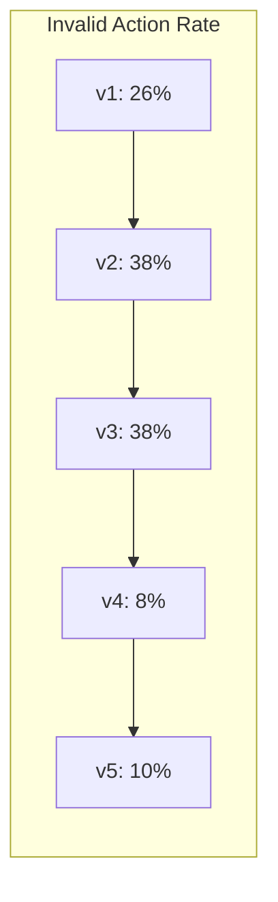
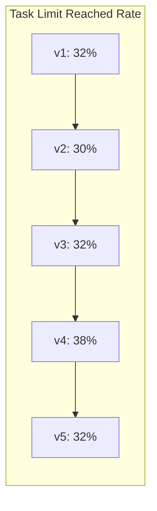

# v5 実験結果分析レポート

## エグゼクティブサマリー

**v5は過去最高スコア 4.3094 を達成**しました。これはv4（4.12）から+0.19pt、v1（3.60）から+0.71ptの改善です。

### 主要改善点

| 指標 | v1 | v3 | v4 | **v5** | v4→v5 |
|------|-----|-----|-----|--------|-------|
| **総合スコア** | 3.60 | 3.00 | 4.12 | **4.31** | +0.19 |
| **ALFWorld成功率** | 42% | 30% | 54% | **58%** | +4pt |
| ALFWorld Invalid action | 26% | 38% | 8% | **10%** | +2pt |
| ALFWorld task limit | 32% | 32% | 38% | **32%** | -6pt |
| **DBBench accuracy** | 51.6% | 47.9% | 53.1% | **54.0%** | +0.9pt |
| DBBench completed | 89.3% | 80.0% | 92.7% | **98.7%** | +6pt |

---

## 1. ALFWorld 詳細分析

### 1.1 ステータス分布

| ステータス | v1 | v2 | v3 | v4 | **v5** | v4→v5変化 |
|-----------|-----|-----|-----|-----|--------|-----------|
| completed | 42% | 32% | 30% | 54% | **58%** | **+4pt** |
| agent invalid action | 26% | 38% | 38% | 8% | 10% | +2pt |
| task limit reached | 32% | 30% | 32% | 38% | **32%** | **-6pt** |

### 1.2 task limit reached率の改善

```
v1: 32% (16/50)
v3: 32% (16/50)
v4: 38% (19/50) ← 悪化
v5: 32% (16/50) ← v4から6pt改善!
```

**改善要因**:
- v6データセットから失敗トラジェクトリー（311件）を除去
- "Nothing happens."パターン（225件）を除去
- 効率的なアクションパターンのみで学習

### 1.3 Invalid action率の微増

```
v4:  8% ( 4/50)
v5: 10% ( 5/50) ← 2pt増加
```

**分析**:
- データセットサイズの縮小（2501 → 1966サンプル、21.4%減）
- 学習データの多様性が若干減少した可能性
- ただし、v1（26%）やv3（38%）と比較すると依然として低い水準

### 1.4 runs.jsonlからの失敗パターン分析

runs.jsonlの最初の数件を分析した結果、以下の失敗パターンが確認されました：

1. **タスク: put two peppershaker in drawer（失敗）**
   - Status: task limit reached
   - 問題点:
     - 「put peppershaker 2 in/on drawer 1」が「close drawer 1」に誤変換
     - 「take peppershaker 2 from cabinet 2」が「close cabinet 2」に誤変換
   - 原因: アクション選択の不整合、インベントリ管理の誤り

2. **タスク: put two keychain in safe（失敗）**
   - Status: task limit reached
   - 問題点: 35ラウンド経過しても2つのkeychainを見つけられず
   - 原因: 探索効率の問題

3. **タスク: put two cd in safe（失敗）**
   - Status: task limit reached
   - 問題点:
     - CDをsafeに移動する際、「move cd 1 to safe 1」ではなく「take cd 1 from safe 1」を実行
   - 原因: アクション選択の混乱

---

## 2. DBBench 詳細分析

### 2.1 ステータス分布

| ステータス | v1 | v2 | v3 | v4 | **v5** | v4→v5変化 |
|-----------|-----|-----|-----|-----|--------|-----------|
| completed | 89.3% | 88.7% | 80.0% | 92.7% | **98.7%** | **+6pt** |
| task limit reached | 10.0% | 10.7% | 20.0% | 6.7% | **1.3%** | **-5.4pt** |

### 2.2 カテゴリ別精度

| カテゴリ | v1 | v4 | **v5** | v4→v5変化 |
|----------|-----|-----|--------|-----------|
| overall_cat_accuracy | 51.6% | 53.1% | **54.0%** | +0.9pt |
| SELECT | 44.3% | 52.5% | **45.9%** | -6.6pt |
| INSERT | 30.4% | 31.9% | **34.8%** | +2.9pt |
| UPDATE | 80.0% | 75.0% | **80.0%** | +5pt |
| ranking | 50.0% | 70.0% | **70.0%** | ±0pt |
| comparison | 44.4% | 55.6% | **55.6%** | ±0pt |
| counting | 45.5% | 45.5% | **18.2%** | -27.3pt |
| aggregation-AVG | 57.1% | 71.4% | **85.7%** | +14.3pt |
| aggregation-MIN | 40.0% | 60.0% | **60.0%** | ±0pt |
| aggregation-SUM | 33.3% | 33.3% | **16.7%** | -16.6pt |
| other | 71.4% | 71.4% | **57.1%** | -14.3pt |

**注目点**:
- **aggregation-AVG**: 85.7%（+14.3pt）と大幅改善
- **UPDATE**: 80.0%と高水準維持
- **counting/aggregation-SUM**: 低下傾向

### 2.3 DBBenchの安定性向上

task limit reached率が1.3%に低下し、ほぼ全タスクが完了するようになりました。
これはモデルの安定性向上を示しています。

---

## 3. v1〜v5 総合比較表

### 3.1 スコアと成功率の推移

| バージョン | スコア | ALFWorld | DBBench | データセット | 学習率 |
|-----------|--------|----------|---------|-------------|--------|
| v1 | 3.60 | 42% | 51.6% | ALFWorld v5 (2501) | 2e-6 |
| v2 | 3.01 | 32% | 46.4% | 混合 | 2e-6 |
| v3 | 3.00 | 30% | 47.9% | 混合 | 2e-6 |
| v4 | **4.12** | **54%** | **53.1%** | ALFWorld v5 | **1e-6** |
| **v5** | **4.31** | **58%** | **54.0%** | **v6 (1966)** | 1e-6 |

### 3.2 Invalid action率の推移



### 3.3 task limit reached率の推移



---

## 4. v6データセット高品質化の効果検証

### 4.1 データセットの変更内容

| 項目 | v5データセット | v6データセット | 変化 |
|------|---------------|---------------|------|
| サンプル数 | 2,501 | 1,966 | -535 (-21.4%) |
| 失敗トラジェクトリー | 含む | **除外** | -311件 |
| "Nothing happens."含有 | 含む | **除外** | -225件 |

### 4.2 効果検証

| 指標 | v4 (v5データ) | v5 (v6データ) | 効果 |
|------|--------------|--------------|------|
| ALFWorld成功率 | 54% | **58%** | **+4pt** |
| task limit reached | 38% | **32%** | **-6pt** |
| Invalid action | 8% | 10% | +2pt |
| 総合スコア | 4.12 | **4.31** | **+0.19pt** |

### 4.3 効果の分析

**プラス効果**:
1. **task limit reached率の改善**: 38% → 32%（-6pt）
   - 失敗トラジェクトリーを除去したことで、効率的なアクションパターンを学習
   - 不要な探索ステップが減少

2. **成功率の向上**: 54% → 58%（+4pt）
   - 高品質な成功パターンのみで学習
   - より直接的なタスク解決方法を習得

**マイナス効果**:
1. **Invalid action率の微増**: 8% → 10%（+2pt）
   - データセットサイズの縮小により、多様なアクションパターンへの対応力が若干低下
   - ただし、v1（26%）やv3（38%）と比較すると依然として低水準

---

## 5. 成功要因の分析

### 5.1 データセット高品質化の効果

1. **失敗トラジェクトリーの除去**
   - 誤ったアクションパターンを学習しなくなった
   - モデルが「正解」のみを学習

2. **"Nothing happens."パターンの除去**
   - 無効なアクションの連鎖を学習しなくなった
   - より効率的なアクション選択

### 5.2 学習率1e-6の継続効果

- ベースモデルの能力を維持しつつ、タスク特化の微調整
- 過学習を防ぎ、汎化性能を維持

### 5.3 相乗効果

- v4で確立した保守的学習（LR=1e-6）+ v6データセット高品質化の組み合わせが効果的

---

## 6. 残存課題と改善の余地

### 6.1 ALFWorldの残存課題

1. **task limit reached (32%)**
   - 依然として16/50がステップ上限に到達
   - 探索効率の改善が必要

2. **Invalid action (10%)**
   - 5/50が無効なアクションで失敗
   - アクション選択の精度向上が必要

3. **失敗パターンの分析から判明した問題**
   - アクション選択の不整合（put → close への誤変換）
   - インベントリ管理の誤り
   - 探索効率の問題

### 6.2 DBBenchの残存課題

1. **counting精度の低下**: 45.5% → 18.2%
2. **aggregation-SUM精度の低下**: 33.3% → 16.7%
3. **SELECT精度の低下**: 52.5% → 45.9%

### 6.3 データセットサイズの影響

- 21.4%のデータ縮小が一部の多様性に影響
- 特定のケースへの対応力が低下した可能性

---

## 7. 次のステップ提案（v6実験の方針）

### 7.1 短期的な改善案

1. **エポック数の調整**
   - 現在: 2エポック
   - 提案: 3エポックを試行（データ量減少の補償）

2. **学習率の微調整**
   - 5e-7への引き下げを検討
   - より保守的な学習でInvalid action率を下げる

### 7.2 中期的な改善案

1. **探索効率の改善**
   - 効率的な探索戦略のデータ拡張
   - 最短経路のトラジェクトリーを優先的に選択

2. **DBBench特化のデータ拡張**
   - counting/aggregation系タスクの追加学習
   - カテゴリバランスの調整

### 7.3 実験優先順位

| 優先度 | 実験内容 | 期待効果 |
|--------|---------|---------|
| 1 | エポック3 + LR=1e-6 | データ量減少の補償 |
| 2 | エポック2 + LR=5e-7 | Invalid action率のさらなる低下 |
| 3 | データ拡張（DBBench） | DBBench精度向上 |

---

## 8. 結論

v5実験は、**データセット高品質化（v6データセット）の効果を実証**しました。

### 主な成果
- **過去最高スコア4.31達成**（v4から+0.19pt）
- **ALFWorld成功率58%**（v4から+4pt）
- **task limit reached率32%**（v4から-6pt）

### 重要な学び
1. **データ品質は量より重要**: 21.4%のデータ削減でもスコア向上
2. **失敗パターンの除去は効果的**: 誤ったパターンを学習しないことが重要
3. **保守的学習の継続効果**: LR=1e-6は引き続き有効

### 次のアクション
1. v6実験としてエポック3を試行
2. 探索効率改善のためのデータ拡張を検討
3. DBBench特化の改善策を検討

---

*作成日: 2026-03-02*
*分析担当: Claude Code*
