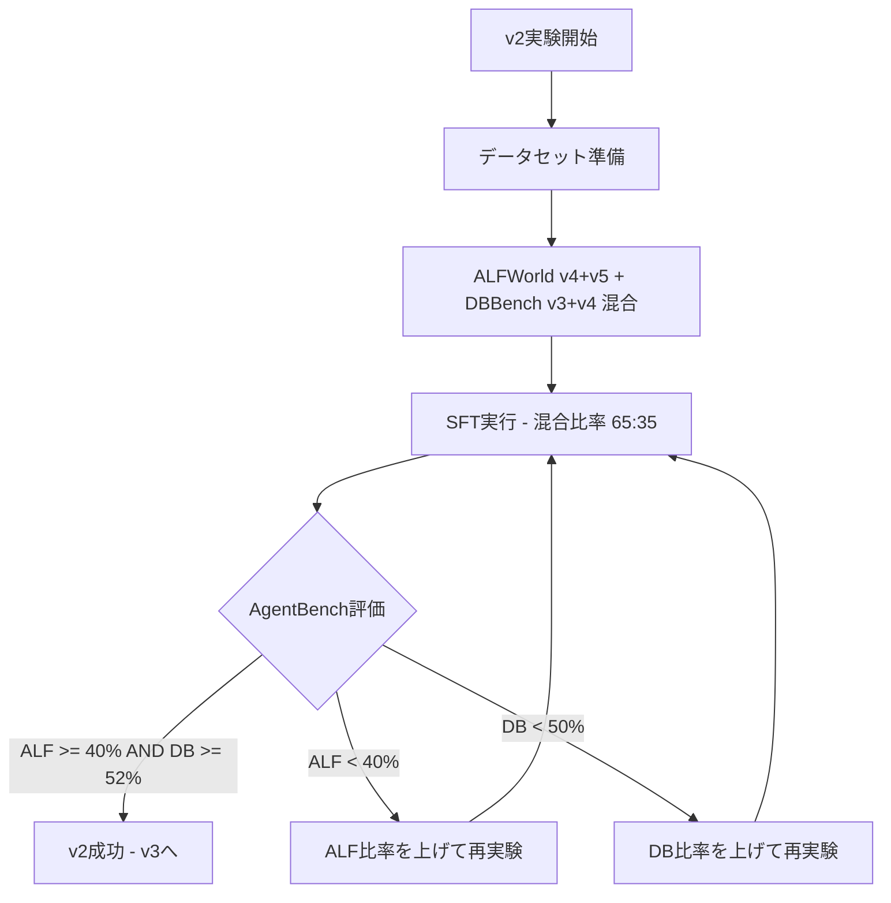
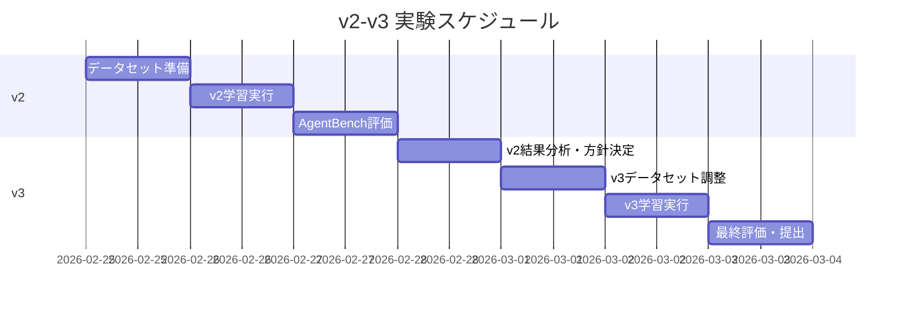

# LLMエージェントコンペティション v2以降戦略

## 1. v1結果の分析

### 1.1 スコアサマリー

| タスク | v1結果 | ベースライン | 差分 |
|--------|--------|--------------|------|
| ALFWorld | 42% (21/50) | 26% (13/50) | **+16pt** ✅ |
| DBBench | 51.6% | 53.7% | **-2.1pt** ⚠️ |

### 1.2 v1の構成

```yaml
ベースモデル: Qwen/Qwen3-4B-Instruct-2507
データセット: ALFWorld v5 (2,502件のみ)
エポック: 2
学習率: 2e-6
LoRA: r=64, alpha=128
MAX_SEQ_LEN: 2048
```

### 1.3 v1の成功要因と課題

**成功要因（ALFWorld）**:
- ALFWorld v5単体でのSFTがベースラインから大幅改善
- 全assistant turnにlossをかける設計が有効に機能

**課題（DBBench）**:
- ALFWorld単体学習でDBBenchがベースラインを下回った
- DBBenchのタスクタイプ別精度にばらつき:
  - UPDATE: 80%（高い）
  - INSERT: 30.4%（低い）
  - aggregation-MAX: 0%（全滅）

### 1.4 DBBench詳細分析

```
タスクタイプ別精度:
- UPDATE: 80.0% ← 強い
- other: 71.4%
- aggregation-AVG: 57.1%
- ranking: 50.0%
- counting: 45.5%
- comparison: 44.4%
- SELECT: 44.3%
- aggregation-MIN: 40.0%
- aggregation-SUM: 33.3%
- INSERT: 30.4% ← 弱い
- aggregation-MAX: 0.0% ← 最弱
```

---

## 2. v2の実験計画

### 2.1 戦略方針

参加者の知見から、以下の重要な制約が判明:

> **混合の閾値問題**: DBBenchを少量（5-20%）混ぜるだけでALFが崩壊する  
> **有効な比率**: ALF 6-7 : DB 3-4

v2では**ALFWorldの成果を維持しつつ、DBBenchを改善**することを目指す。

### 2.2 使用データセット

| データセット | バージョン | 件数 | 用途 |
|-------------|-----------|------|------|
| ALFWorld | v4 + v5 | 5,004件 | メイン（約65%） |
| DBBench | v3 + v4 | 2,400件 | サブ（約35%） |

**合計: 約7,400件**（混合比率 ALF:DB ≒ 65:35）

**データセット選択理由**:
- ALFWorld v4-v5: 大規模（各2,502件）で品質が安定
- DBBench v3-v4: 長めのターン（7-10ターン）が含まれ、recovery/retryパターンあり

### 2.3 ベースモデルの選択

**Qwen/Qwen3-4B-Instruct-2507を継続使用**

理由:
1. v1で既に良好な結果を得ている（ALFWorld +16pt）
2. 4B規模で学習コストが抑えられる
3. Qwen2.5-7Bは得意不得意が異なる（coolが0%）が、4Bはcoolも解ける

### 2.4 ハイパーパラメータ方針

```yaml
# v2 推奨設定
ベースモデル: Qwen/Qwen3-4B-Instruct-2507
MAX_SEQ_LEN: 2048
エポック: 2  # v1と同じ
学習率: 1e-6  # v1より控えめ（混合データ安定化のため）
LoRA: r=64, alpha=128
バッチサイズ: 2 x 4 = 8
WARMUP_RATIO: 0.1
```

**変更ポイント**:
- 学習率を2e-6→1e-6に下げる（混合データでの安定化）
- エポック数は維持（過学習回避）

### 2.5 実験フロー



---

## 3. v3以降の方向性

### 3.1 v2結果に応じた分岐シナリオ

#### シナリオA: v2が両タスクで改善した場合

```
目標: ALF >= 45%, DB >= 55%
方針: データ品質の向上に注力
アクション:
  - 弱点タスク（INSERT, aggregation-MAX）の重点サンプリング
  - ALFWorldのclean/heat失敗パターンを補強
```

#### シナリオB: ALFWorldが低下した場合

```
目標: ALFを維持しつつDBを改善
方針: 2段階学習を検討
アクション:
  1. 第1段階: ALFWorld v5単体で学習（v1と同じ）
  2. 第2段階: 少量のDBBenchデータで追加学習
  または
  - ALF比率を70%以上に引き上げ
```

#### シナリオC: DBBenchが改善しない場合

```
目標: DB >= 55%
方針: DBBench特化データの品質改善
アクション:
  - DBBench v4のrecovery/retryパターンを重点的に追加
  - INSERT/aggregation-MAXタスクのアップサンプリング
```

### 3.2 v3で検討する追加施策

1. **タスクタイプ別アップサンプリング**
   - DBBench: INSERT、aggregation-MAX/SUMを2倍にサンプリング
   - ALFWorld: clean、heatタスクを重点的に追加

2. **データ品質フィルタリング**
   - 失敗トラジェクトリの除去を検討
   - 長すぎるシーケンス（MAX_SEQ_LEN超過）の削除

3. **学習率スケジューリング**
   - 混合データでは低めの学習率から開始
   - タスク別に異なる学習率の適用を検討

---

## 4. リスク管理

### 4.1 ロールバック基準

| 指標 | 警告レベル | ロールバック |
|------|----------|-------------|
| ALFWorld | < 38% | v1モデルに戻す |
| DBBench | < 48% | 混合比率を見直す |
| 両方低下 | ALF < 35% AND DB < 50% | v1に戻し、戦略を再検討 |

### 4.2 監視ポイント

1. **Validation Lossの罠に注意**
   - Loss低下 ≠ 性能向上
   - 必ずAgentBenchで実測評価を行う

2. **混合データの副作用**
   - ALFWorldのタスクでDBBenchっぽい出力が出ていないか確認
   - 逆も同様（DBBenchでALFWorld風の短いactionが出ていないか）

3. **実行時間の管理**
   - AgentBench評価に時間がかかるため、1日2-3実験が限度
   - 優先度の高い実験から実施

### 4.3 チェックポイント保存方針

```
保存タイミング:
- 100ステップごと（SAVE_STEPS=100）
- 最新2つを保持（SAVE_TOTAL_LIMIT=2）

ベストモデルの基準:
- AgentBenchでの総合スコアが最高のもの
- Validation Lossではなく実測評価を優先
```

---

## 5. 実験スケジュール



---

## 6. まとめ

### v2の目標
- ALFWorld: 40%以上を維持（v1: 42%）
- DBBench: 52%以上に改善（v1: 51.6%）

### 重要な学び（参加者知見より）
1. ALFWorld単体SFTは確実に効く
2. 混合データは慎重に（ALF優位の比率を保つ）
3. Validation Lossを信じすぎない
4. AgentBench実測が唯一の正解指標

### 次のアクション
1. ALFWorld v4+v5とDBBench v3+v4を65:35で混合
2. 学習率1e-6でSFT実行
3. AgentBenchで評価し、結果に応じてv3方針を決定
