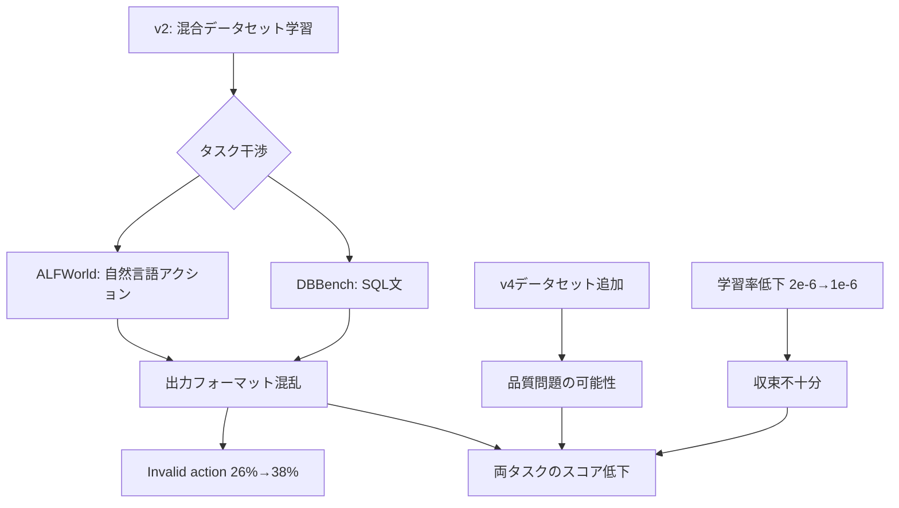
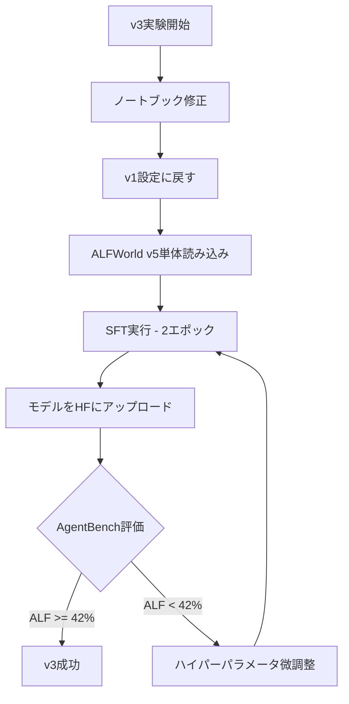

# v3戦略ドキュメント

## エグゼクティブサマリー

**選択戦略: Option A（v1回帰戦略）**

v2でのスコア大幅低下（3.5987 → 3.0144）を踏まえ、v3では**ALFWorld v5単体でのSFT**に回帰します。DBBenchはベースラインに任せ、確実なスコア向上を目指します。

---

## 1. v2分析結果の要約

### 1.1 スコア変化

| Version | Total Score | ALFWorld | DBBench |
|---------|-------------|----------|---------|
| ベースライン | - | 26% (13/50) | 53.7% |
| **v1** | **3.5987** | 42% (21/50) | 51.6% |
| v2 | 3.0144 | 32% (16/50) | 46.4% |
| **目標v3** | **≥3.68** | ≥42% | ≥53% |

### 1.2 v2失敗の根本原因



#### 主要な発見

1. **混合学習によるタスク干渉**
   - ALFWorld（自然言語）とDBBench（SQL）の異なるフォーマットが干渉
   - v2ではInvalid actionが26%→38%に増加

2. **タスクタイプ別の全滅**
   - put_two: 0/8（0%）
   - examine: 0/8（0%）

3. **参加者の知見**（[`information/other_member_ideas.md`](../information/other_member_ideas.md) より）
   - ALFWorld単体SFTは確実に効く（Person7, 8）
   - DBBenchを少量（5-20%）混ぜるだけでALFが崩壊
   - 有効な比率は ALF 6-7 : DB 3-4 だが、それでもリスクあり

---

## 2. 戦略オプションの評価

### 2.1 Option A: v1回帰戦略 ✅ **推奨**

| 項目 | 内容 |
|------|------|
| データセット | ALFWorld v5単体（2,502件） |
| DBBench対応 | ベースライン（53.7%）に任せる |
| 予想スコア | ALF 42%以上、DB 53%程度 → Total ≈ **3.68** |
| リスク | 低（v1で実証済み） |

**メリット:**
- v1で実証済みの成功パターン
- 混合学習による干渉を完全に排除
- 確実なスコア向上が見込める

**デメリット:**
- DBBenchの改善は望めない
- ALFWorldのさらなる向上は限定的

### 2.2 Option B: ALFWorld強化戦略

| 項目 | 内容 |
|------|------|
| データセット | ALFWorld v5単体 + put_two/examine強化 |
| 予想スコア | ALF 45%以上、DB 53%程度 → Total ≈ 3.77 |
| リスク | 中（追加データの品質に依存） |

**評価:** データ作成コストと時間を考慮すると、現時点では見送り

### 2.3 Option C: 2段階学習戦略

| 項目 | 内容 |
|------|------|
| 第1段階 | ALFWorld v5単体でSFT |
| 第2段階 | 少量のDBBench（10%以下）で微調整 |
| 予想スコア | ALF 40%以上、DB 52%以上 → Total ≈ 3.54 |
| リスク | 高（第2段階でALF崩壊のリスク） |

**評価:** 参加者の知見から、少量のDBBench追加でもALFが崩壊するリスクが高い

---

## 3. 選択戦略の詳細: Option A

### 3.1 データセット構成

```yaml
# v3 データセット設定
ALFWORLD_DATASETS:
  - u-10bei/sft_alfworld_trajectory_dataset_v5

DBBENCH_DATASETS: []  # 使用しない

# 合計: 2,502件（ALFWorld v5のみ）
```

**選択理由:**
1. v1と完全に同じ構成で再現性を確保
2. v5は最新の品質管理済みデータセット
3. 混合による干渉リスクを完全に排除

### 3.2 ハイパーパラメータ設定

```yaml
# v3 推奨設定（v1と同一）
ベースモデル: Qwen/Qwen3-4B-Instruct-2507
MAX_SEQ_LEN: 2048
エポック: 2
学習率: 2e-6  # v1と同じ（v2の1e-6から戻す）
LoRA:
  r: 64
  alpha: 128
  target_modules: all-linear
バッチサイズ: 2 × 4 = 8
WARMUP_RATIO: 0.1
```

**変更ポイント:**
| パラメータ | v2 | v3 | 理由 |
|------------|-----|-----|------|
| 学習率 | 1e-6 | **2e-6** | v1で成功した設定に戻す |
| データセット | 混合7,400件 | **ALF単体2,502件** | 干渉を排除 |
| エポック | 2 | 2 | 維持 |

### 3.3 目標スコア

| タスク | v1結果 | v3目標 | ベースライン |
|--------|--------|--------|--------------|
| ALFWorld | 42% (21/50) | **≥42%** | 26% |
| DBBench | 51.6% | **≥53%** | 53.7% |
| **Total** | 3.5987 | **≥3.68** | - |

**スコア計算:**
```
Total Score = (50/13) × (DBBench_accuracy + ALFWorld_SR)
v3予測 = (50/13) × (0.537 + 0.42) = 3.68
```

---

## 4. 実装計画

### 4.1 実行フロー



### 4.2 ノートブック修正箇所

[`notebooks/コード_SFT_v2.ipynb`](../notebooks/コード_SFT_v2.ipynb) をベースに以下を修正:

1. **VERSION設定**
   ```python
   VERSION = 3  # v2 → v3
   ```

2. **データセット設定**
   ```python
   # v3: ALFWorld v5単体（v1回帰）
   ALFWORLD_DATASETS = ["u-10bei/sft_alfworld_trajectory_dataset_v5"]
   DBBENCH_DATASETS = []
   ```

3. **学習率**
   ```python
   LR = 2e-6  # v2の1e-6から戻す
   ```

---

## 5. リスク管理

### 5.1 想定リスクと対策

| リスク | 確率 | 影響 | 対策 |
|--------|------|------|------|
| ALFWorldがv1を下回る | 低 | 高 | v1と同一設定で再現性確保 |
| DBBenchがベースラインを下回る | 中 | 中 | ALF単体学習でDB干渉なし |
| put_two/examineが改善しない | 高 | 中 | v4以降で追加データ検討 |
| Omni環境とLB結果の乖離 | 中 | 中 | 複数回提出で傾向確認 |

### 5.2 ロールバック基準

| 指標 | 警告レベル | ロールバック |
|------|----------|-------------|
| ALFWorld | < 38% | エポック数/LR調整 |
| DBBench | < 50% | 許容（ベースライン信頼） |
| 両方低下 | ALF < 35% AND DB < 50% | 完全にv1に戻す |

### 5.3 監視ポイント

1. **Validation Lossの罠に注意**
   - Loss低下 ≠ 性能向上
   - 必ずAgentBenchで実測評価

2. **タスクタイプ別の確認**
   - put_two, examine が依然0%なら、v4で追加データ検討
   - clean, heatタスクの改善状況も確認

---

## 6. v4以降の方向性

### 6.1 v3結果に応じた分岐

#### シナリオA: v3が目標達成（ALF ≥42%, Total ≥3.68）

```
方針: ALFWorldのさらなる強化
アクション:
  - put_two/examineタスクの追加データ作成
  - エポック数を3に増やす検討
  - 目標: ALF 45%以上
```

#### シナリオB: v3がv1を下回る（ALF < 42%）

```
方針: ハイパーパラメータ調整
アクション:
  - 学習率を微調整（2e-6 → 3e-6）
  - MAX_SEQ_LENを増加（2048 → 4096）
  - バッチサイズを調整
```

### 6.2 長期的な改善案

1. **タスクタイプ別アップサンプリング**
   - put_two, examineタスクを重点的に追加
   - cleanタスクの成功パターンを増量

2. **アクションフォーマットの検証**
   - SFTデータと評価環境のコマンド形式を比較
   - 必要に応じてデータセットを修正

3. **2モデル戦略の検討**
   - ALFWorld専用モデルとDBBench専用モデルの並行開発
   - コンペルール上で可能か要確認

---

## 7. まとめ

### 選択した戦略

**Option A: v1回帰戦略**

- ALFWorld v5単体（2,502件）でSFT
- 学習率 2e-6、エポック 2（v1と同一）
- DBBenchはベースライン（53.7%）に任せる

### 選択理由

1. v2の分析結果から、混合学習は両タスクを低下させることが明確
2. 参加者の知見でもALFWorld単体SFTが最も効果的と報告
3. v1で実証済みの成功パターンで確実なスコア向上を狙う
4. 時間制約の中で最もリスクの低い選択

### 期待されるスコア

| 項目 | v2 | v3目標 | 改善幅 |
|------|-----|--------|--------|
| ALFWorld | 32% | 42% | **+10pt** |
| DBBench | 46.4% | 53% | **+6.6pt** |
| **Total** | 3.0144 | **3.68** | **+0.67pt** |

---

*作成日: 2026-02-27*
*ステータス: 承認待ち*
