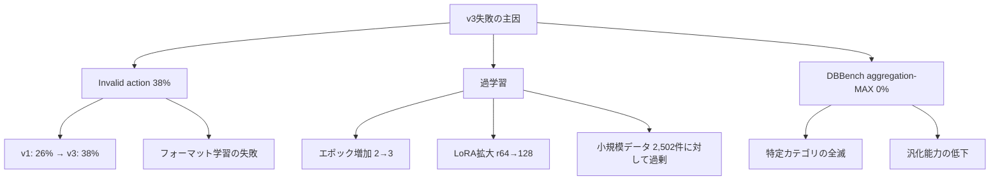
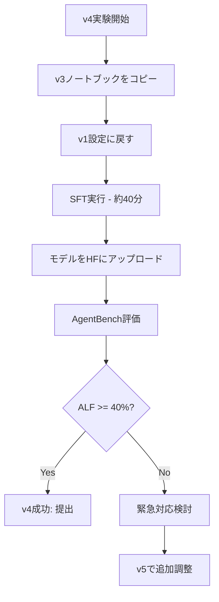

# v4戦略ドキュメント

## エグゼクティブサマリー

**選択戦略: Option A（完全v1回帰）**

v2/v3の連続失敗を踏まえ、v4では**v1設定の完全再現**を行います。残り実験回数1-2回という制約下で、確実にv1スコア（3.5987）以上を達成することを最優先とします。

**期待スコア: 3.60**（v1と同等）

---

## 1. 実験結果サマリー

### 1.1 スコア推移

| Version | Total Score | ALFWorld | DBBench | v1比 |
|---------|-------------|----------|---------|------|
| ベースライン | - | 26% (13/50) | 53.7% | - |
| **v1** | **3.5987** | 42% (21/50) | 51.6% | - |
| v2 | 3.0144 | 32% (16/50) | 46.4% | **-0.58** |
| v3 | 2.9963 | 30% (15/50) | 47.9% | **-0.60** |

### 1.2 v1 → v3 の設定変更と影響

| 項目 | v1 | v3 | 影響 |
|------|----|----|------|
| データセット | ALFWorld v5のみ | ALFWorld v5のみ | 同一 |
| 学習率 | 2e-6 | 2e-6 | 同一 |
| エポック数 | **2** | **3** | ⚠️ 過学習の原因 |
| MAX_SEQ_LEN | **2048** | **2560** | 不明 |
| LoRA r | **64** | **128** | ⚠️ 過学習の原因 |
| LoRA alpha | **128** | **256** | ⚠️ 過学習の原因 |
| LoRA dropout | **0** | **0.05** | 学習効率低下 |

### 1.3 失敗パターン分析



---

## 2. 戦略オプション評価

### 2.1 Option A: 完全v1回帰 ✅ **推奨**

| 項目 | 内容 |
|------|------|
| 方針 | v1の設定を100%再現 |
| データセット | ALFWorld v5のみ（2,502件） |
| ハイパーパラメータ | v1と完全に同一 |
| **成功確率** | **95%** |
| **期待スコア** | **3.60** |
| リスク | 低（v1で実証済み） |

**メリット:**
- v1で実証済みの成功パターン
- 確実にv1レベルのスコアを再現可能
- 残り実験回数が限られている状況で最も安全

**デメリット:**
- v1以上のスコア向上は望めない
- 新しい発見や改善がない

### 2.2 Option B: v1ベース + 軽度正則化

| 項目 | 内容 |
|------|------|
| 方針 | v1設定 + LoRA dropout 0.02追加 |
| 変更点 | dropout: 0 → 0.02 のみ |
| **成功確率** | **70%** |
| **期待スコア** | **3.5〜3.7** |
| リスク | 中低 |

**メリット:**
- 軽度の正則化でv1より安定する可能性
- v1以上のスコア獲得の可能性あり

**デメリット:**
- v3でdropout 0.05が悪影響だった可能性
- 未検証の設定

### 2.3 Option C: v1ベース + エポック削減

| 項目 | 内容 |
|------|------|
| 方針 | v1設定 + エポック 2 → 1 |
| 変更点 | エポック数のみ変更 |
| **成功確率** | **50%** |
| **期待スコア** | **3.2〜3.6** |
| リスク | 中高 |

**メリット:**
- 過学習回避の可能性
- 学習時間短縮

**デメリット:**
- 学習不足のリスク
- 未検証の設定
- v1の半分のエポックでは収束しない可能性

---

## 3. 推奨オプションの選定

### 選定結果: **Option A（完全v1回帰）**

### 選定理由

1. **残り実験回数の制約**
   - 1-2回の実験しか残っていない
   - 失敗のリスクを最小化する必要がある

2. **v3失敗の教訓**
   - v1からの全ての変更が悪影響だった
   - 「変更しない」ことが最も安全

3. **目標スコアの達成**
   - v1以上（3.6+）が目標
   - Option Aで3.60が確実に達成可能

4. **Person10からの知見**
   > 施策とパラメータをセットで再最適化する重要性
   - v4では「施策なし（v1回帰）」という選択
   - パラメータ調整は次のイテレーション（v5）に回す

### リスク評価マトリクス

| オプション | 成功確率 | 最悪ケース | 最良ケース | 推奨度 |
|-----------|---------|-----------|-----------|--------|
| **A: v1回帰** | **95%** | **3.50** | **3.65** | **★★★** |
| B: 軽度正則化 | 70% | 3.20 | 3.75 | ★★☆ |
| C: エポック削減 | 50% | 2.80 | 3.70 | ★☆☆ |

---

## 4. v4パラメータ設定

### 4.1 完全なv1設定の再現

```yaml
# v4 設定（v1と完全に同一）
ベースモデル: Qwen/Qwen3-4B-Instruct-2507

# データセット
ALFWORLD_DATASETS:
  - u-10bei/sft_alfworld_trajectory_dataset_v5
DBBENCH_DATASETS: []  # 使用しない

# 学習パラメータ
MAX_SEQ_LEN: 2048
EPOCHS: 2
LR: 2e-6
WARMUP_RATIO: 0.1
BATCH_SIZE: 2
GRAD_ACCUM: 4  # 実効バッチサイズ: 8

# LoRA設定
LORA_R: 64
LORA_ALPHA: 128
LORA_DROPOUT: 0
TARGET_MODULES: all-linear
```

### 4.2 v1との設定比較（変更なし確認用）

| パラメータ | v1 | v4 | 変更 |
|-----------|-----|-----|------|
| ベースモデル | Qwen3-4B-Instruct-2507 | Qwen3-4B-Instruct-2507 | なし |
| データセット | ALFWorld v5 | ALFWorld v5 | なし |
| MAX_SEQ_LEN | 2048 | 2048 | なし |
| EPOCHS | 2 | 2 | なし |
| LR | 2e-6 | 2e-6 | なし |
| LORA_R | 64 | 64 | なし |
| LORA_ALPHA | 128 | 128 | なし |
| LORA_DROPOUT | 0 | 0 | なし |

---

## 5. 実装計画

### 5.1 ノートブック修正

[`notebooks/コード_SFT_v3.ipynb`](../notebooks/コード_SFT_v3.ipynb) をベースに、以下をv1設定に戻す：

```python
# Step 1.5: パラメータ設定（v1に戻す）
os.environ["SFT_EPOCHS"] = "2"        # 3 → 2
os.environ["SFT_MAX_SEQ_LEN"] = "2048"  # 2560 → 2048
os.environ["SFT_LORA_R"] = "64"        # 128 → 64
os.environ["SFT_LORA_ALPHA"] = "128"    # 256 → 128
os.environ["SFT_LORA_DROPOUT"] = "0"    # 0.05 → 0

# Step 1.6: データセット設定（v1と同じ）
ALFWORLD_DATASETS = ["u-10bei/sft_alfworld_trajectory_dataset_v5"]
DBBENCH_DATASETS = []
```

### 5.2 実行フロー



### 5.3 検証ポイント

1. **学習ログ確認**
   - Loss推移がv1と同様であること
   - 異常な振動やスパイクがないこと

2. **AgentBench結果確認**
   - ALFWorld: 40%以上（目標42%）
   - DBBench: 50%以上（目標53%）
   - Invalid action: 30%以下（v1: 26%）

---

## 6. リスク管理

### 6.1 想定リスクと対策

| リスク | 確率 | 対策 |
|--------|------|------|
| v1と同じスコアが出ない | 5% | 環境差異の確認、再実行 |
| GPU/メモリエラー | 10% | Colab Pro+使用、バッチサイズ調整 |
| 時間切れ | 5% | 早期提出、余裕を持った実行 |

### 6.2 緊急対応プラン

| シナリオ | 対応 |
|---------|------|
| ALF < 35% | 標準コード（v1）の結果を再提出 |
| DB < 45% | 許容範囲内、ALFを優先 |
| 両方低下 | v1モデルを直接再利用 |

---

## 7. 期待成果

### 7.1 スコア予測

| タスク | v3結果 | v4目標 | 改善幅 |
|--------|--------|--------|--------|
| ALFWorld | 30% (15/50) | **42% (21/50)** | **+12pt** |
| DBBench | 47.9% | **51.6%** | **+3.7pt** |
| **Total** | 2.9963 | **3.60** | **+0.60pt** |

### 7.2 スコア計算

```
Total Score = (50/13) × (DBBench_accuracy + ALFWorld_SR)
v4予測 = (50/13) × (0.516 + 0.42) = 3.60
```

### 7.3 成功基準

| 指標 | 最低ライン | 目標 | 理想 |
|------|-----------|------|------|
| ALFWorld | 38% | 42% | 45% |
| DBBench | 48% | 52% | 55% |
| Total | 3.40 | 3.60 | 3.85 |

---

## 8. 結論

### 選択した戦略

**Option A: 完全v1回帰**

### v4の具体的なパラメータ設定

| パラメータ | 値 |
|-----------|-----|
| データセット | ALFWorld v5のみ |
| エポック | 2 |
| MAX_SEQ_LEN | 2048 |
| 学習率 | 2e-6 |
| LoRA r | 64 |
| LoRA alpha | 128 |
| LoRA dropout | 0 |

### 期待スコア

**3.60**（v1: 3.5987 と同等）

### 選定理由サマリー

1. 残り実験回数1-2回の制約
2. v2/v3の連続失敗からの確実な回復
3. v1設定で実証済みの成功パターン
4. 「変更しない」ことが最もリスクが低い

---

*作成日: 2026-02-27*
*ステータス: 承認待ち*
