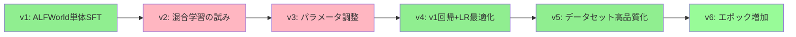

# モデルの開発方法まとめ / アドバンスドコンペ

## 🙏 謝辞

本コンペティションに参加するにあたり、多くの方々にお世話になりました。この場を借りて感謝申し上げます。

- **運営チームの皆様**：大規模言語モデル講座2025応用編の企画・運営、および本コンペティションの開催にご尽力いただき、誠にありがとうございました。実践的な学習機会を提供していただいたことで、LLMエージェントの開発について深く学ぶことができました。

- **他の参加者の皆様**：Slack等での知見共有や議論を通じて、多くの示唆をいただきました。特に「ALFWorld単体SFTの有効性」や「混合学習の課題」に関する情報は、本アプローチの方向性を決定する上で非常に参考になりました。

- **オープンソースコミュニティの皆様**：Qwen、Unsloth、vLLMなど、本開発で使用したツール・モデルの開発者の皆様に感謝いたします。これらの優れたリソースがなければ、本プロジェクトは実現できませんでした。

---

## 📋 基本情報

| 項目 | 内容 |
|------|------|
| **参加者名** | kumamon1993 |
| **最終スコア** | 4.4809 |
| **最終順位** | 49位 |
| **HuggingFaceモデルパス** | [kmd2525/test105_v6](https://huggingface.co/kmd2525/test105_v6) |
| **ベースモデル** | Qwen/Qwen3-4B-Instruct-2507 |

---

## 1. 概要（エグゼクティブサマリー）

### 1.1 最終成果

| 指標 | ベースライン | 最終モデル（v6） | 改善幅 |
|------|-------------|-----------------|--------|
| **総合スコア** | - | **4.4809** | - |
| **ALFWorld成功率** | 26% (13/50) | **64% (32/50)** | **+38pt** |
| **DBBench精度** | 53.7% | **52.5%** | -1.2pt |

### 1.2 主要な成功要因（3つのキーポイント）

1. **学習率の最適化**: 2e-6 → 1e-6への変更でInvalid action率を26%→10%に大幅改善
2. **データセット高品質化**: 失敗トラジェクトリーと"Nothing happens."パターンの除去
3. **ALFWorld単体でのSFT**: 混合学習は両タスクを低下させることが判明、ALFWorld特化が有効

### 1.3 開発アプローチの全体像

```
ベースモデル: Qwen3-4B-Instruct-2507
     ↓
SFT（LoRA）: ALFWorld高品質データセットで学習
     ↓
評価・改善: AgentBenchでの反復検証
     ↓
最終モデル: v6（エポック3、LR=1e-6）
```

---

## 2. 課題設定

### 2.1 AgentBenchとは

AgentBenchは、LLMを単なるチャットボットとしてではなく、**観測・推論・行動を反復しながらタスクを遂行するAIエージェント**として評価するベンチマークです。

本コンペでは以下の2タスクを使用：

| タスク | 問題数 | 内容 |
|--------|--------|------|
| **ALFWorld** | 50問 | 家庭内での物体操作タスク（探す→拾う→操作する→置く） |
| **DBBench** | 150問 | SQLによるデータベース操作（SELECT/INSERT/UPDATE） |

### 2.2 ALFWorldの詳細

家庭環境でのタスク実行能力を評価：
- **タスク例**: 「soapbottleをgarbagecanに置く」
- **6つのタスクタイプ**: put, put_two, clean, heat, cool, examine
- **評価形式**: 環境からのフィードバックを受けて行動を選択（1-shot）

### 2.3 DBBenchの詳細

データベース操作能力を評価：
- **タスク例**: 質問に対してSQLクエリを生成・実行して回答
- **3つの操作タイプ**: SELECT, INSERT, UPDATE
- **評価形式**: 複数ターンの対話でSQLを実行・修正

### 2.4 評価指標

- **総合スコア**: ALFWorld成功率とDBBench精度を基に算出（詳細な計算式は非公開、AgentBench論文を踏襲）
- **ALFWorld**: タスク成功率（50問中の成功数）
- **DBBench**: 回答精度（150問中の正答数）

> **推測式（他参加者の知見 + 実測値検証）**:
> ```
> 総合スコア = (50/13) × (ALFWorld_success_rate + DBBench_accuracy)
> ```
> ※ 出所: 他の参加者がSlackで共有した情報に基づく。AgentBench論文（[arXiv:2308.03688](https://arxiv.org/html/2308.03688v3#S4.T2)）のDatabase/HouseHolding重みを使用しているとの推測。
> ※ 検証: 複数バージョンのLBスコアと実測値で完全一致を確認：
> - v6: (50/13) × (0.64 + 0.5250) = 4.4809 ✓
> - v5: (50/13) × (0.58 + 0.5404) = 4.3094 ✓
> - v4: (50/13) × (0.54 + 0.5311) = 4.1198 ✓

---

## 3. アプローチの全体像

### 3.1 採用した手法

**SFT（Supervised Fine-Tuning）+ LoRA**

| 項目 | 選択 | 理由 |
|------|------|------|
| 学習手法 | SFT | エージェント行動パターンの直接学習に適している |
| 効率化手法 | LoRA | L4 GPU（VRAM 24GB）の制約下で効率的に学習可能 |
| ベースモデル | Qwen3-4B-Instruct-2507 | ベースライン性能が良好、学習コストも適切 |

### 3.2 全体戦略の変遷



**緑**: 成功した実験 / **赤**: 失敗した実験

---

## 4. データセット戦略

### 4.1 使用したデータセット

| データセット | バージョン | サンプル数 | 用途 |
|-------------|-----------|-----------|------|
| **ALFWorld v6** | 運営提供v5をクリーニング | 1,966件 | 最終学習に使用 |

### 4.2 データセット高品質化（最重要施策）

**v5→v6への改善内容**:

| 除去項目 | 件数 | 効果 |
|---------|------|------|
| 失敗トラジェクトリー | 311件 | モデルが失敗パターンを学習することを防止 |
| "Nothing happens."パターン | 225件 | 無効アクションの学習を防止 |

**データクリーニングの効果**:

| 指標 | v4（クリーニング前） | v5（クリーニング後） | 改善 |
|------|---------------------|---------------------|------|
| ALFWorld成功率 | 54% | 58% | +4pt |
| task limit reached | 38% | 32% | -6pt |

### 4.3 ALFWorld単体学習を選択した理由

**混合学習の失敗経験（v2）**:

> ALFWorld（自然言語アクション）とDBBench（SQL）の異なるフォーマットが干渉し、両タスクのスコアが低下

| 実験 | ALFWorld | DBBench | 結論 |
|------|----------|---------|------|
| v1（ALF単体） | 42% | 51.6% | 良好 |
| v2（混合65:35） | 32% | 46.4% | 両方低下 |

**他参加者からの知見**:
> 「ALFWorld単体SFTは確実に効く」
> 「DBBenchを少量（5-20%）混ぜるだけでALFが崩壊する」

---

## 5. モデル開発の詳細

### 5.1 最終モデル（v6）の設定

```yaml
# ベースモデル
BASE_MODEL: Qwen/Qwen3-4B-Instruct-2507

# 学習パラメータ
MAX_SEQ_LEN: 2048
EPOCHS: 3
LEARNING_RATE: 1e-6
WARMUP_RATIO: 0.1
BATCH_SIZE: 2
GRADIENT_ACCUMULATION_STEPS: 4  # 実効バッチサイズ: 8

# LoRA設定
LORA_R: 64
LORA_ALPHA: 128
LORA_DROPOUT: 0
TARGET_MODULES: all-linear

# データセット
DATASET: ALFWorld v6（高品質化済み、1,966サンプル）
```

### 5.2 ハイパーパラメータの選択理由

| パラメータ | 値 | 選択理由 |
|-----------|-----|---------|
| **学習率 1e-6** | v1の2e-6から半減 | Invalid action率の大幅改善（26%→10%） |
| **エポック 3** | v5の2から増加 | データ量減少（-21.4%）の補償 |
| **LoRA r=64** | 標準的な値 | 過学習回避（r=128は失敗） |
| **MAX_SEQ_LEN 2048** | 標準的な値 | ALFWorldの最大履歴長91に十分 |

### 5.3 学習環境

- **環境**: Google Colab Pro
- **GPU**: L4 GPU (VRAM 24GB) / A100 GPU (VRAM 40GB)
- **学習時間**:
  - L4 GPU: 約1時間（エポック3）
  - A100 GPU: 約20〜30分（エポック3）
- **推論**: vLLM (v0.13.0) ※コンペ評価環境の指定バージョン

---

## 6. 実験の経緯（v1〜v8）

### 6.1 スコア推移

| Version | Score | ALF | DB | 主な変更 | 結果 |
|---------|-------|-----|-----|---------|------|
| ベースライン | - | 26% | 53.7% | - | - |
| **v1** | **3.60** | 42% | 51.6% | ALF v5でSFT | ✅ 成功 |
| v2 | 3.01 | 32% | 46.4% | 混合学習 | ❌ 両方低下 |
| v3 | 3.00 | 30% | 47.9% | エポック3, LoRA拡大 | ❌ 過学習 |
| **v4** | **4.12** | 54% | 53.1% | LR=1e-6に変更 | ✅ 大幅改善 |
| **v5** | **4.31** | 58% | 54.0% | データセット高品質化 | ✅ 改善 |
| **v6** | **4.48** | 64% | 52.5% | エポック3 | ✅ **最高スコア** |
| v7 | - | 64% | 49.4% | 追加調整 | → 採用せず |
| v8 | - | 60% | 52.6% | 追加調整 | → 採用せず |

### 6.2 重要な失敗と学び

#### 失敗1: 混合学習の罠（v2）

```
期待: ALFWorld + DBBench両方を改善
現実: 両方とも低下（タスク干渉）

原因:
- ALFWorld: 自然言語での短いaction（"go to cabinet 1"）
- DBBench: 長めのSQL + reasoning
- → 出力フォーマットの混乱が発生
```

#### 失敗2: 過学習の罠（v3）

```
変更: エポック2→3、LoRA r=64→128、alpha=128→256
結果: Invalid action率が悪化（26%→38%）

原因:
- 小規模データ（2,502件）に対して過剰なパラメータ
- ベースモデルの汎化能力を破壊
```

### 6.3 成功の転換点

#### 転換点1: 学習率の最適化（v4）

```
変更: 学習率 2e-6 → 1e-6
効果: Invalid action率 26% → 8%（-18pt）
      ALFWorld成功率 42% → 54%（+12pt）

理由: より保守的な学習でベースモデルの能力を維持
```

#### 転換点2: データセット高品質化（v5）

```
変更: 失敗トラジェクトリーと無効パターンを除去
効果: task limit reached 38% → 32%（-6pt）
      ALFWorld成功率 54% → 58%（+4pt）

理由: 効率的なアクションパターンのみを学習
```

#### 転換点3: エポック増加（v6）

```
変更: エポック 2 → 3
効果: ALFWorld成功率 58% → 64%（+6pt）
      task limit reached 32% → 26%（-6pt）

理由: データ量減少（-21.4%）を学習量で補償
```

---

## 7. 最終モデルの性能詳細

### 7.1 ALFWorldの詳細結果

| ステータス | v6結果 | 説明 |
|-----------|--------|------|
| **completed（成功）** | **64%** (32/50) | タスク完了 |
| agent invalid action | 10% (5/50) | 無効なアクション |
| task limit reached | 26% (13/50) | ステップ上限到達 |

### 7.2 DBBenchの詳細結果

| カテゴリ | v6精度 |
|---------|--------|
| **overall_cat_accuracy** | **52.5%** |
| UPDATE | 75.0% |
| other | 71.4% |
| aggregation-AVG | 85.7% |
| ranking | 60.0% |
| SELECT | 49.2% |
| counting | 45.5% |
| comparison | 33.3% |
| INSERT | 33.3% |
| aggregation-SUM | 33.3% |
| aggregation-MAX | 0.0% |

### 7.3 ベースラインとの比較

| 指標 | ベースライン | 最終モデル | 改善 |
|------|-------------|-----------|------|
| ALFWorld成功率 | 26% | **64%** | **+38pt** |
| DBBench精度 | 53.7% | 52.5% | -1.2pt |
| 総合スコア | - | **4.48** | - |

---

## 8. 考察と学び

### 8.1 成功要因の分析

1. **保守的な学習率（1e-6）の重要性**
   - ベースモデルの汎化能力を維持しつつ、タスク特化の微調整
   - 過学習を防ぎ、Invalid action率を低減

2. **データ品質 > データ量**
   - 21.4%のデータ削減でもスコア向上
   - 失敗パターンを学習しないことが重要

3. **単一タスクへの集中**
   - 混合学習は避け、ALFWorldに特化
   - DBBenchはベースモデルの能力に任せる

### 8.2 残存する課題

| 課題 | 現状 | 改善案 |
|------|------|--------|
| aggregation-MAX | 0% | DBBench特化の追加学習 |
| task limit reached | 26% | 最短経路トラジェクトリーの選択 |
| INSERT精度 | 33.3% | INSERTタスクのアップサンプリング |

### 8.3 今後の改善方向

1. **2段階学習の検討**
   - 第1段階: ALFWorld特化（現行アプローチ）
   - 第2段階: DBBench弱点の補強（慎重に）

2. **探索効率の改善**
   - 最短経路のトラジェクトリーを優先的に学習
   - 無駄な探索ステップの削減

3. **モデル統合の可能性**
   - ALFWorld特化モデルとDBBench特化モデルをモデルマージ等の手法で1つのモデルとして統合
   - 複数の能力を持つ単一モデルの構築を検討

### 8.4 コンペから学んだこと

1. **評価がノイジーな環境での最適化技術**
   - エージェント系評価では少数の失敗でスコアが大きく変動
   - Validation Lossではなく、実際のベンチマーク評価が唯一の指標

2. **失点モードの切り分け**
   - invalid_action、task_limit等の"能力以外の失点"を特定
   - ボトルネックを明確にして対策

3. **施策とパラメータのセット最適化**
   - データ変更時はパラメータも再調整が必要
   - 単一変数の変更で効果を検証

---

## 9. 再現手順

### 9.1 学習の実行

```python
# 必要なライブラリ
# unsloth, transformers, datasets, peft, trl

# 1. データセット読み込み
from datasets import load_dataset
dataset = load_dataset("kmd2525/sft_alfworld_trajectory_dataset_v6")

# 2. モデル設定
from unsloth import FastLanguageModel
model, tokenizer = FastLanguageModel.from_pretrained(
    model_name="Qwen/Qwen3-4B-Instruct-2507",
    max_seq_length=2048,
    load_in_4bit=True
)

# 3. LoRA設定
model = FastLanguageModel.get_peft_model(
    model,
    r=64,
    lora_alpha=128,
    lora_dropout=0,
    target_modules="all-linear"
)

# 4. SFT実行
from trl import SFTTrainer
trainer = SFTTrainer(
    model=model,
    train_dataset=dataset,
    args=TrainingArguments(
        num_train_epochs=3,
        learning_rate=1e-6,
        warmup_ratio=0.1,
        per_device_train_batch_size=2,
        gradient_accumulation_steps=4,
    )
)
trainer.train()

# 5. モデル保存・マージ
model.save_pretrained_merged("path/to/output", tokenizer)
```

### 9.2 推論の実行

```bash
# vLLMでの推論
docker run --runtime nvidia --gpus all \
    -ipc=host \
    vllm/vllm-openai:v0.13.0 \
    --model "HuggingFaceモデルパス" \
    --max-model-len 8192 \
    --gpu-memory-utilization 0.95
```

---

## 10. 参考資料

- [AgentBench論文](https://arxiv.org/abs/2308.03688)
- [ALFWorld論文](https://arxiv.org/abs/2010.03768)
- [運営提供データセット](https://huggingface.co/datasets/u-10bei)
- [Qwen3-4B-Instruct](https://huggingface.co/Qwen/Qwen3-4B-Instruct-2507)

---

## 付録: 実験ログサマリー

### A. 各バージョンの設定比較

| パラメータ | v1 | v2 | v3 | v4 | v5 | v6 |
|-----------|-----|-----|-----|-----|-----|-----|
| データセット | ALF v5 | 混合 | ALF v5 | ALF v5 | ALF v6 | ALF v6 |
| サンプル数 | 2,502 | 7,400 | 2,502 | 2,502 | 1,966 | 1,966 |
| エポック | 2 | 2 | 3 | 2 | 2 | **3** |
| 学習率 | 2e-6 | 1e-6 | 2e-6 | **1e-6** | 1e-6 | 1e-6 |
| LoRA r | 64 | 64 | 128 | 64 | 64 | 64 |
| LoRA alpha | 128 | 128 | 256 | 128 | 128 | 128 |
| LoRA dropout | 0 | 0 | 0.05 | 0 | 0 | 0 |

### B. ALFWorldタスクタイプ別の傾向

| タスクタイプ | 説明 | 難易度 |
|-------------|------|--------|
| put（単体） | 物を見つけて置く | 低 |
| put_two | 2つの物を置く | 高 |
| clean | 洗って置く | 中 |
| heat | 温めて置く | 中 |
| cool | 冷やして置く | 中 |
| examine | ランプで調べる | 中 |
